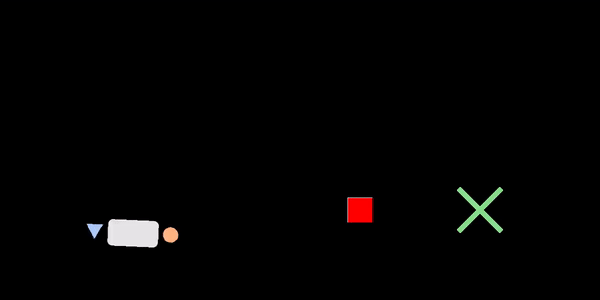

# Table Carrying Simulator

A *continuous state-action* gym environment for human-robot cooperative table-carrying. Map configurations are customizable.  

<p align="center">
  
  <p align="center">(╯°□°）╯┬─┬ノ( ◕◡◕ ノ)<p align="center">
</p>  
  
## About

Diverse behaviors remain a key barrier to human-robot cooperation. This is a **continuous state-action custom environment** for a two-agent task, intended to be a benchmark environment for **human-robot cooperative** physical tasks. Cooperative carrying is also suitable for measuring **interaction metrics**, e.g. interaction forces (when the two agents are compressing or stretching the table in dissent), idle time (when one agent stops moving, perhaps as a signal to the other to take over leadership or allow navigation around an obstacle), etc. For cooperative tasks, such metrics are important to capture to determine the quality of interaction. 

The objective is to carry the table from start to goal while avoiding obstacles. Each agent is physically constrained to the table while moving it, but can exert a force on the side they are carrying it. Rewards can be customized to achieve task success (reaching goal without hitting obstacles), but also other cooperative objectives (minimal interaction forces, etc. for *fluency*).

The main branch environment is used in the 2023 ICRA paper **[It Takes Two: Learning to Plan for Human-Robot Cooperative Carrying](https://sites.google.com/view/cooperative-carrying)** [1].


## Installation

We recommend using any environment manager to keep your dependencies clean. Example conda configuration:
```
conda create --name table python=3.8
conda activate table-carrying
git clone git@github.com:eley-ng/table-carrying-ai.git
cd table-carrying-ai
pip install -r requirements.txt --use-deprecated=legacy-resolver
pip install -e .
```

To test your install,
```
python tests/test_gym_table.py
```

### Note on interfaces:
For interaction, you can choose keyboard (discrete actions) or joystick (continuous actions) modes. For joystick interface, any USB peripheral with stick control (e.g. PS5 controller) works. You can test whether the controller is recognized by pygame using the following script:

```
python tests/test_joystick.py
```

## Quickstart

### Dataset and trained models download
Download human-human demonstration dataset, trained models, human-in-the-loop trajectories collected for [1]: [Link](https://drive.google.com/drive/folders/1RqmUrl0xPPURRrGFpoC3pgIm-NmgyKV6?usp=share_link). "trained_models", "datasets", "results", should be in the base directory. Note that an optional `results` directory from a sample evaluation with human recorded data and robot planner is included for plotting in this Quickstart section.

### Install robot planner (Required! if running robot in planner mode)
Install the cooperative planner from [1] as a submodule in the `algo/planners` folder as instructed [here](https://github.com/eleyng/cooperative_planner). 

### Run trained planners with human data playback
After downloading the data and trained models, you can now setup a few experiments:

- To see the robot planner playing with a collected human trajectory, run:  
`python scripts/test_model.py --run-mode hil --robot-mode planner --human-mode data`

- To interactively play with the robot planner, run:  
`python scripts/test_model.py --run-mode hil --robot-mode planner --human-mode real --human-control [keyboard | joystick]`
For keyboard control, **use 'WASD'** (not arrow keys). **Player 1 is robot (blue triangle), player 2 is the human (orange circle).**  

- To playback some data, run:  
`python scripts/test_model.py --run-mode replay_traj --robot-mode data --human-mode data`
- To see the robot planner planning actions for both agents, run:
`python scripts/test_model.py --run-mode coplanning --robot-mode planner --human-mode planner`  

Note that the planner requires a ground truth trajectory's first H steps of data to be fed into the model (default: H = 30 , which is ~1 sec given default FPS = 30). The ground truth trajectory is also used to set the configuration (obstacles, initial pose, goal location) for the run, and helps us compare the planned trajectories to the ground truth trajectories.

To set the path for various test set ground truth trajectories:
- For the unseen map dataset, set the  `--data-dir` flag to `datasets/rnd_obstacle_v3/random_run_name_3/trajectories` (currently default).
- For the test holdout dataset, set the `--data-dir` flag to `datasets/demonstrations/trajectories/test/test_holdout`.  

### Visualizing
To visualize your human-in-the-loop trials (or other experiment), run:  
`python scripts/plot_traj.py --path-to-traj [path to .npz traj from experiment] --path-to-gt [path to .npz ground truth traj] --path-to-map [path to .npz map config file collected from the same run as the ground truth traj]`  

Add the `--video` flag if you'd like to convert the images into a video!  

A set of evaluations with human control and robot planner is included in the [dataset download](https://drive.google.com/drive/folders/1JMZys9Bfc-COZtvbLST4uiyrHnEyNIpK?usp=share_link) for quickstart plotting -- place the `results/` directory in the base dir of this repo and run the above command without any args (add the `--video` flag if you would like to render a video).

## Custom Env Structure Overview

The core custom environment code is under `cooperative-transport`, which contains:

```
└── cooperative-transport/
    ├── config/
    │   ├── maps/
    │   │   ├── rnd_obstacle_v2.yml
    │   │   └── ... (custom map configs specified here: potential obstacle locations, goal locations, and initial table pose which the env will sample from)
    │   ├── game_objects_params.yml : specify physics parameters and video rendering parameters
    │   └── inference_params.yml
    ├── envs/
        ├── __init__.py
        ├── game_objects/
        │   ├── images/
        │   │   └── ... (images for the game)
        │   └── game_objects.py
        ├── table_env.py
        └── utils.py
```

To test if your local install works, run the following test scripts:

```    
└── tests/
    ├── test_joystick.py : check if joystick(s) are working if using joystick control
    └── test_gym_table.py : check if env is working
```

There are several things you can do with this environment, by running any of the following scripts:

```
└── scripts/
    ├── data_playback.py : render a saved trajectory with pygame
    ├── play.py : collect demonstrations with two humans (**interactive**)
    ├── test_model.py : can play in: 1) (**interactive**) one-player (human) w/ robot, 2) robot only (**See "Dataset and Trained Models" section**).
    └── plot_traj.py : plot a saved trajectory and save as sequence of images, and option to turn images to video
```

All configurations are stored in the `configs` dir.

```
└── configs/
    ├── dataset_processing_params.yml : yaml for demonstration data collection (use with scripts/play.py).
    ├── experiment/
    │    └── experiment_config.py : main-level arguments for scripts/test_model.py. 
    └── robot/
        ├── robot_planner_config.py: arguments for robot planner if it is used in scripts/test_model.py.
        └── robot_policy_config.py: arguments for robot policy if it is used in scripts/test_model.py.
        
```

## Dataset Options

### Collecting Your Own Dataset

To collect your own dataset with two humans, run:  
`python scripts/play.py --map_config {path to map config} --run_name {name of session for data collection} ...`  
See file for additional optional args. For each dataset collection session, you can record as many trajectories with your partner as needed. Several directories will be created to log the collected data:  
- `demos/{map_config_name}/{custom_session_name}/trajectories/` : each trajectory generates a new pkl in this directory to store the following ([see file for details](https://github.com/eleyng/table-carrying-ai/blob/5e6f22161d730b095f12e81a49e062e67d1aae66/cooperative_transport/gym_table/envs/table_env.py#L522)): table pose, velocity, each agents' actions, reward, done, success, n_step, dt, goal position, obstalce positions, points to describe the walls, cumulative reward  
- `demos/{map_config_name}/{custom_session_name}/map_cfg/` : since you can sample random configurations of obstacles, initial positions, and goal locations described in the map config (example config [here](https://github.com/eleyng/table-carrying-ai/blob/main/cooperative_transport/gym_table/config/maps/rnd_obstacle_v2.yml), each trajectory generates a .npz in this directory to store the sampled map config for the corresponding run.  
- `demos/{map_config_name}/{custom_session_name}/fluency/` : logs the fluency metrics computed for each trajectory, stored in a .npz.
- `demos/{map_config_name}/{custom_session_name}/figures/` : saves the RGB images for each trajectory.  

The trajectory data is collected as a .pkl, and you can run processing on it to convert to .npz, and other steps like low-pass filters to the actions, skip frames, or removing frames with stopped motion. If you are collecting a human-human demo dataset and wish to visualize any of the trajectories, you **must run the dataprocessing script** to use any of the visualization tools (since trajectories are required to be in .npz). To run the dataprocessing script, modify `configs/dataset_processing_params.yml`, then run `python scripts/process_data.py`. 

### Downloading Dataset from [1]

See dataset download instructions under Quickstart section. Note, the data for training the model in [1] has been processed into a different format than the properties set in the data processing script [here](https://github.com/eleyng/table-carrying-ai/blob/main/scripts/process_data.py).

## Running Trained Models with Human-in-the-Loop

To evaluate your model, you can load it and play with it in real time as human teleoperator. To do so: 
1. Download trained models or create a dir `trained_models` and upload your model in this format: `trained_models/{name of model}/{name of check point to load}.ckpt`.
2. Run `python scripts/test_model.py` using various flags (see file for details). You can run the model autonomously, or run with a human in the loop.
3. Runs will be saved as a .npz file. You can visualize them via `scipts/plot_traj.py`.

## Further Use Cases

In the `scripts/test_model.py` script, you can run several types of experiments by indicating options:
- `--robot-mode [planner | policy | data]`
- `--human-mode [real | data | policy]`

## Cite
If you would like to use our environment, please cite us:
```
@article{ng2022takes,
  title={It Takes Two: Learning to Plan for Human-Robot Cooperative Carrying},
  author={Ng, Eley and Liu, Ziang and Kennedy III, Monroe},
  journal={arXiv preprint arXiv:2209.12890},
  year={2022}
}
```

## Upcoming features:
- integration with imitation library [added 3/7/22] -- Now you can train policies via the [imitation lib](https://imitation.readthedocs.io/en/latest/) and deploy them on the env.

## Contact  
For issues, comments, suggestions, or discussion, please contact [Eley Ng](https://eleyng.github.io) at eleyng@stanford.edu.
