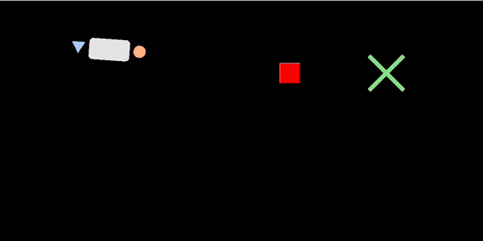

# Table Carrying Simulator

A custom gym environment for human-robot table-carrying, a *joint-action* cooperative task. Map configurations customizable.  

<p align="center">
  
  <p align="center">(╯°□°）╯┬─┬ノ( ◕◡◕ ノ)<p align="center">
</p>  
  
## About

This is a continuous state-action custom environment for a two-agent cooperative carrying task. Possible configurations are human-human, human-robot, and robot-robot. 

The objective is to carry the table from start to goal while avoiding obstacles. Each agent is physically constrained to the table while moving it. Rewards can be customized to achieve task success (reaching goal without hitting obstacles), but also other cooperative objectives (minimal interaction forces, etc. for *fluency*).

The main branch environment is used in the 2023 paper *[It Takes Two: Learning to Plan for Human-Robot Cooperative Carrying](https://arxiv.org/abs/2209.12890)* [1].  
Link to [video](https://www.youtube.com/watch?v=CqWh-yWOgeA).


## Installation

We recommend using any environment manager to keep your dependencies clean. Example conda configuration:
```
conda create --name table python=3.8
conda activate table-carrying
git clone git@github.com:eley-ng/table-carrying-ai.git
cd table-carrying-ai
pip install -r requirements.txt --use-deprecated=legacy-resolver
pip install -e .
```

To test your install,
```
python tests/test_gym_table.py
```

### Note on interfaces:
For interaction, you can choose keyboard (discrete actions) or joystick (continuous actions) modes. For joystick interface, any USB peripheral with stick control (e.g. PS5 controller) works. You can test the controller is recognized by pygame using the following script:

```
python tests/test_joystick.py
```

## Custom Env Structure Overview

The core custom environment code is under `cooperative-transport`, which contains:

```
└── cooperative-transport/
    ├── config/
    │   ├── maps/
    │   │   ├── rnd_obstacle_v2.yml
    │   │   └── ... (custom map configs specified here: potential obstacle locations, goal locations, and initial table pose which the env will sample from)
    │   ├── game_objects_params.yml : specify physics parameters and video rendering parameters
    │   └── inference_params.yml
    ├── envs/
        ├── __init__.py
        ├── game_objects/
        │   ├── images/
        │   │   └── ... (images for the game)
        │   └── game_objects.py
        ├── table_env.py
        └── utils.py
```

To test if your local install works, run the following test scripts:

```    
└── tests/
    ├── test_joystick.py : check if joystick(s) are working if using joystick control
    └── test_gym_table.py : check if env is working
```

There are several things you can do with this environment, by running any of the following scripts:

```
└── scripts/
    ├── data_playback.py : render a saved trajectory with pygame
    ├── play.py : collect demonstrations with two humans (**interactive**)
    ├── test_model.py : can play in: 1) (**interactive**) one-player (human) w/ robot, 2) robot only (**See "Dataset and Trained Models" section**).
    └── visualize.py : plot a saved trajectory and save as image  
```

## Dataset and Trained Models
Download human-human demonstration dataset and trained models, collected for [1]: [Link](https://drive.google.com/drive/folders/1RqmUrl0xPPURRrGFpoC3pgIm-NmgyKV6?usp=share_link). Both folders ("trained_models", "datasets") should be in the base directory.


## TODO:
- add trained models
- add model class example
- add scripts  
  - play.py (completed)
  - test_model.py
  - visualize.py
- test download instructions   

## Contact  
For issues, comments, suggestions, or anything else, please contact [Eley Ng](https://eleyng.github.io) at eleyng@stanford.edu.
